# 📘 EdTech Project Documentation
## Web Technology Subject Project

## 📚 Project Details
- **Subject:** Web Technology  
- **Languages Used:** HTML, CSS, JavaScript  
- **Description:** This EdTech website provides grammar lessons, maths formulas, quizzes, tourist places, personalities, and award winners with clean UI and interactive modals.

---

## 🖼️ Project Screenshots

**Home Page (English)** | **Home Page (Kannada)**
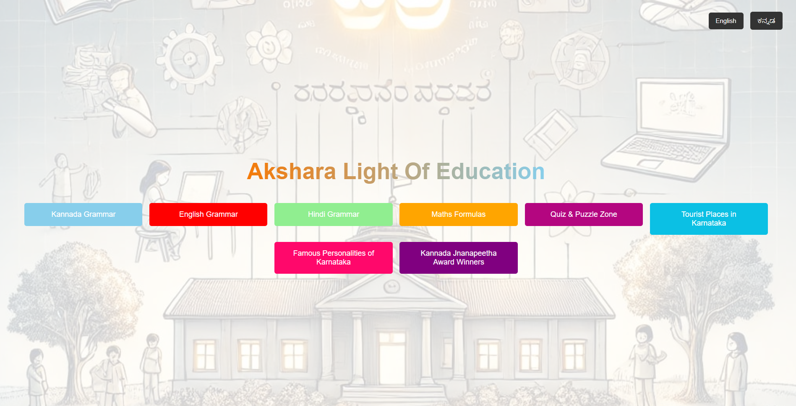 | 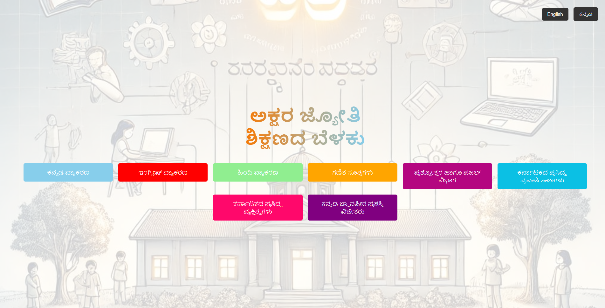
--- | ---

**ಕನ್ನಡ ವ್ಯಾಕರಣ ವಿಭಾಗ** | **English Grammar Section**
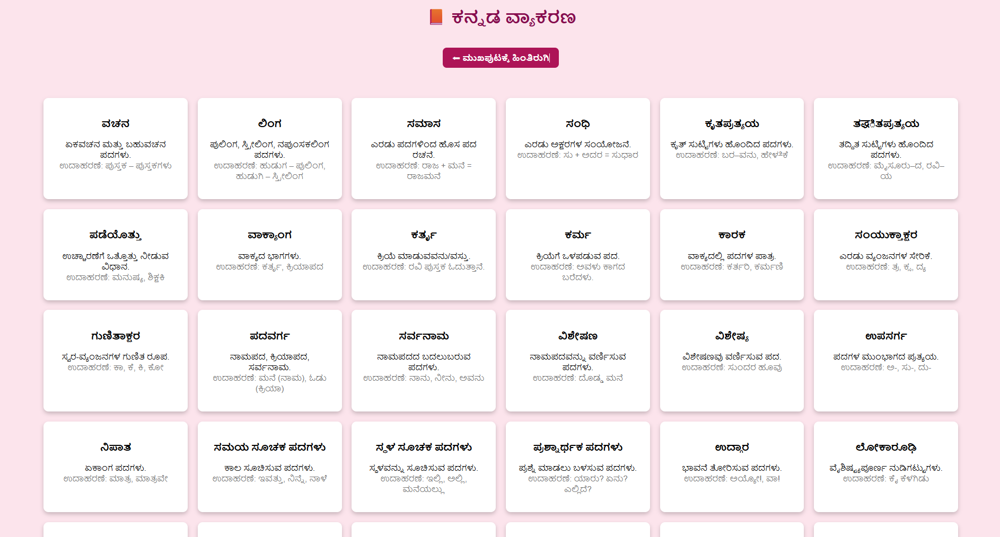 | 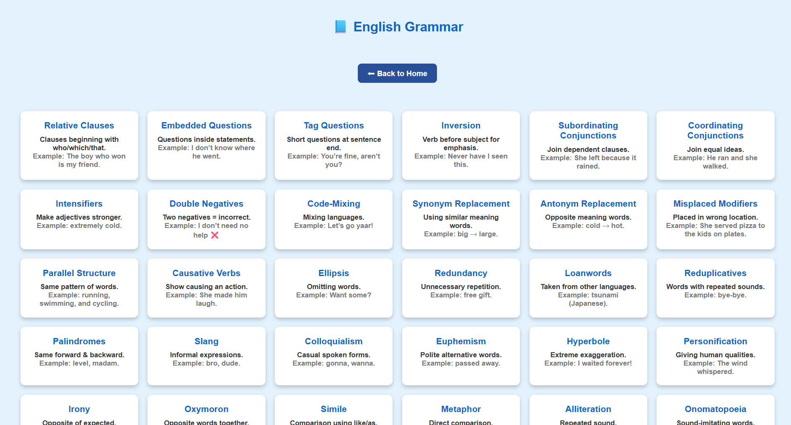
--- | ---

**हिन्दी व्याकरण विभाग** | **Maths Formula Section**
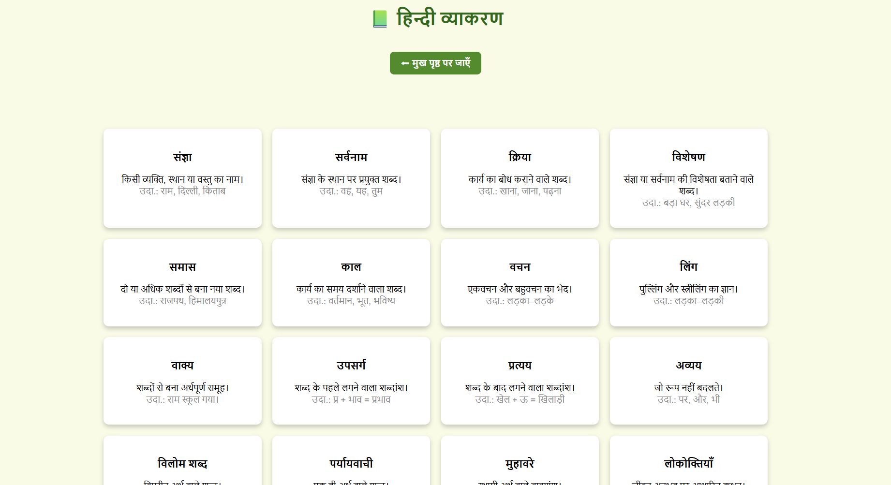 | 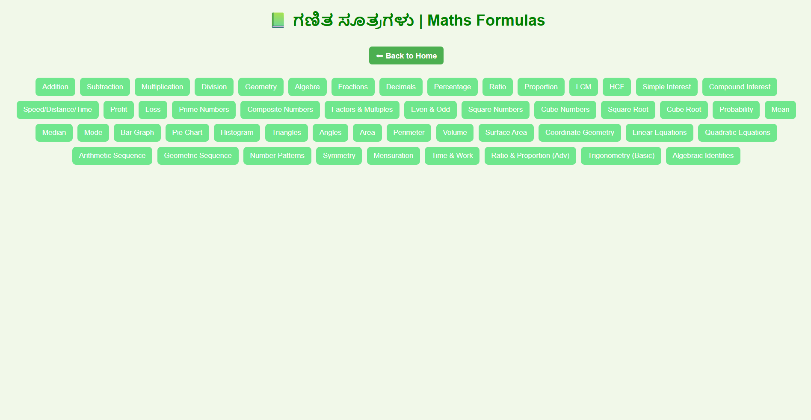
--- | ---

**Maths Formula (Opened)** | **MCQ Quiz**
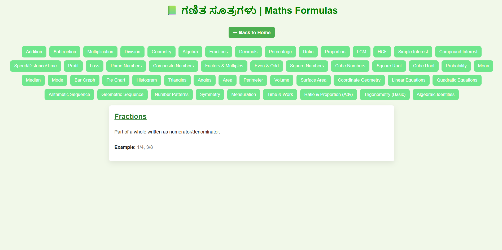 | 
--- | ---

**MCQ Correct** | **MCQ Wrong**
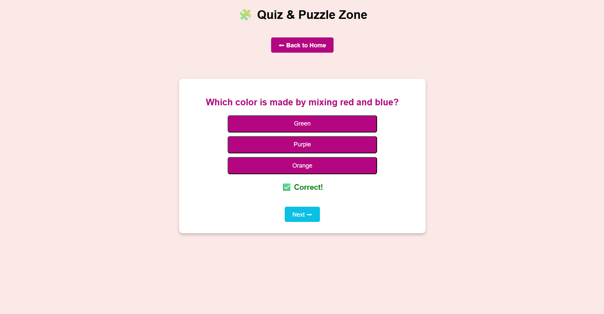 | 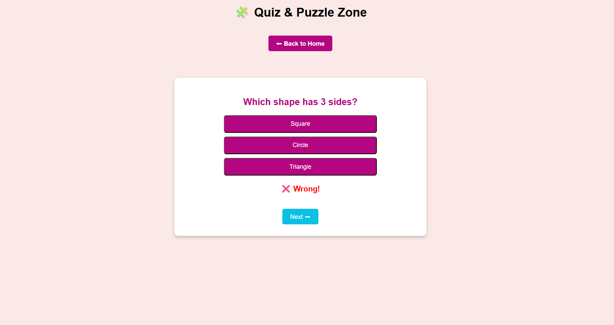
--- | ---

**MCQ Completed** | **Tourist Places Section**
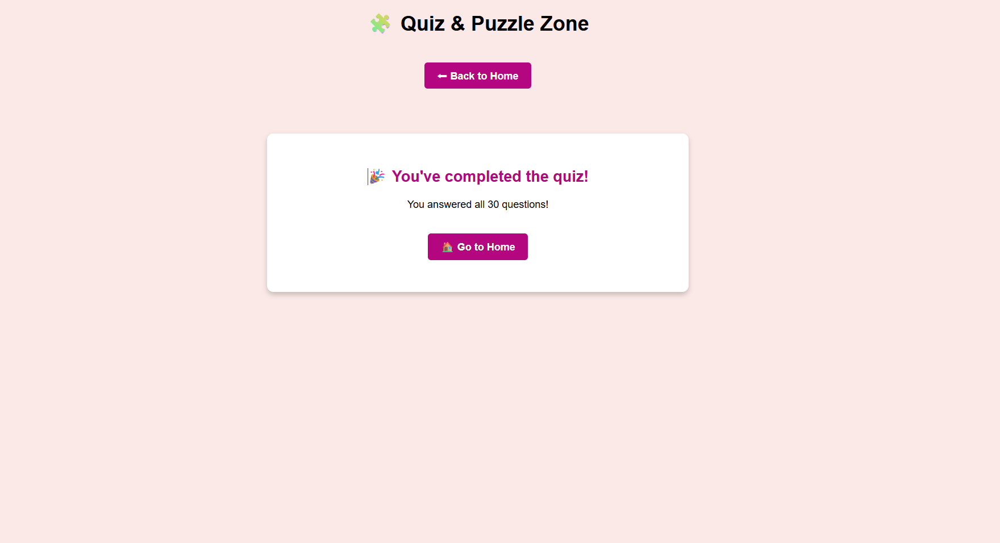 | 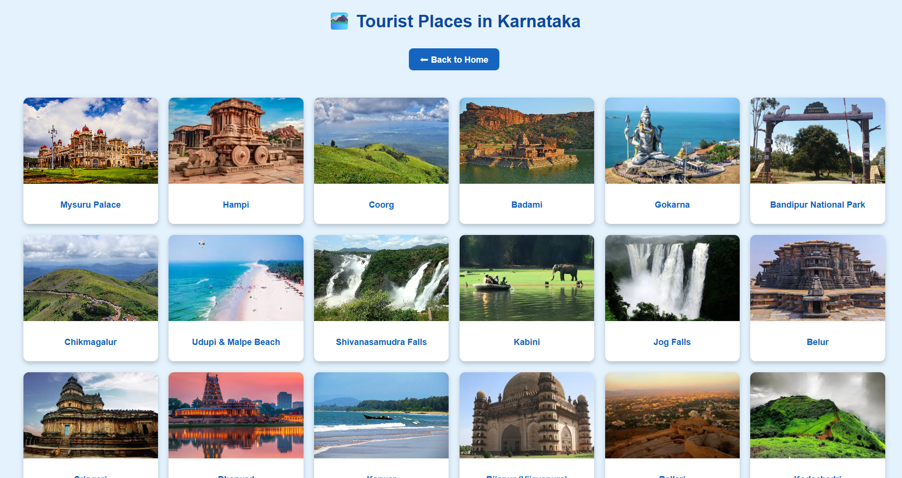
--- | ---

**Tourist Place Details** | **Famous Personalities Section**
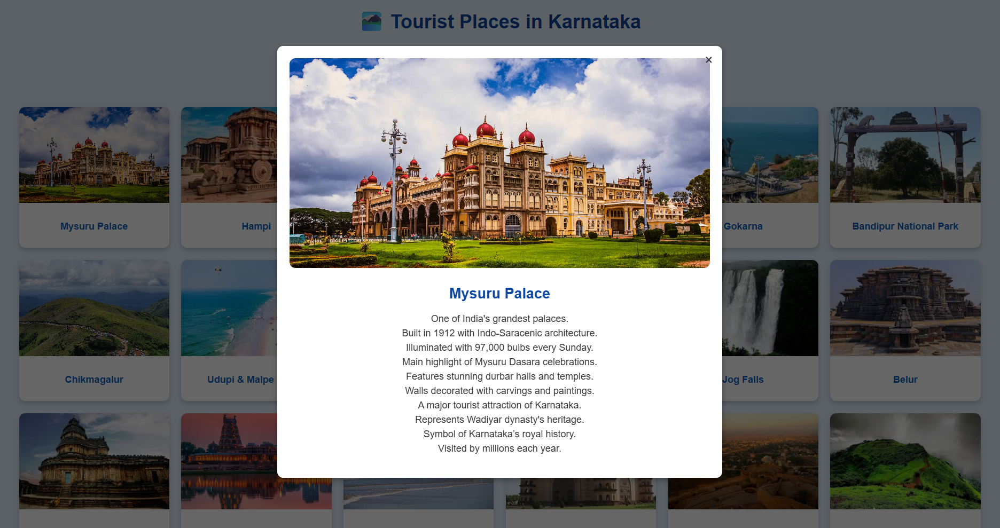 | 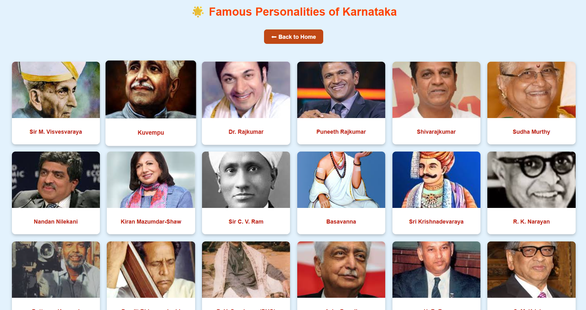
--- | ---

**Famous Personality Details** | **Jnanapitha Winners**
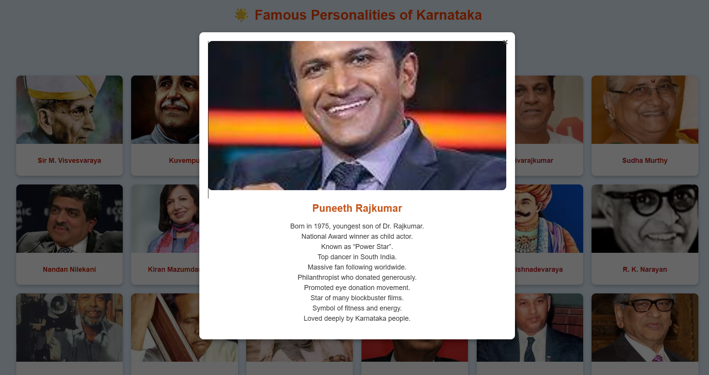 | 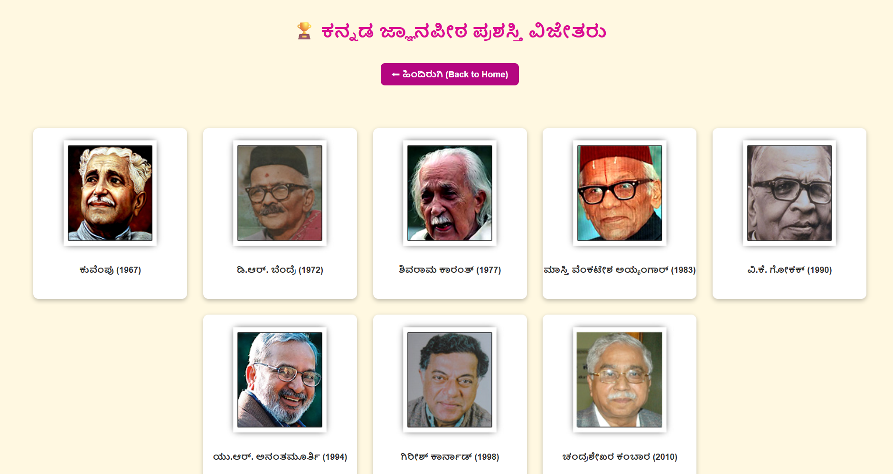
--- | ---

**Jnanapitha Winner Details** |
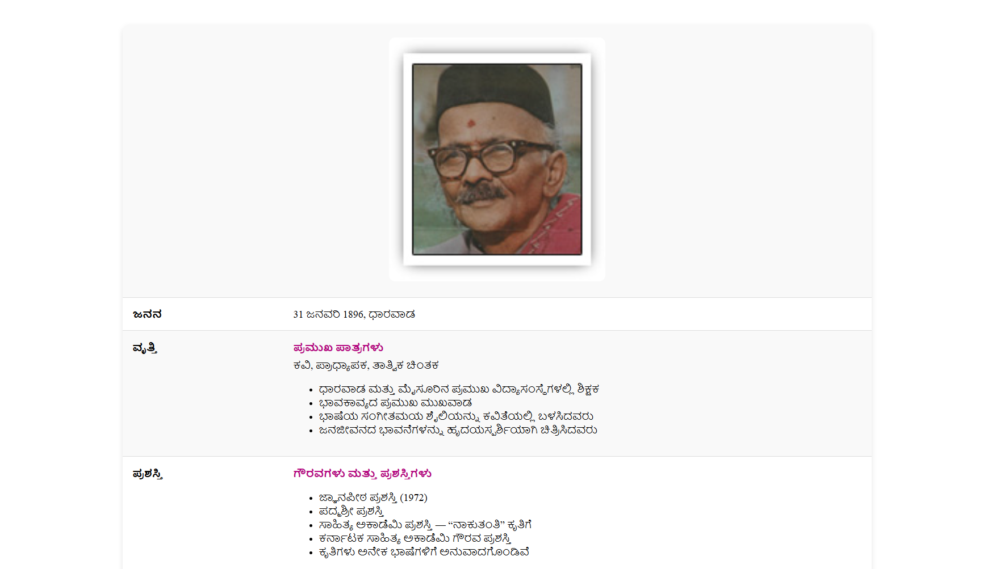 |
--- |

### Award Winners  
**Jnanapitha Winner Details**

### 🌐 Live Demo  
🔗 https://mahekar001aditya.github.io/EdTech_2/

